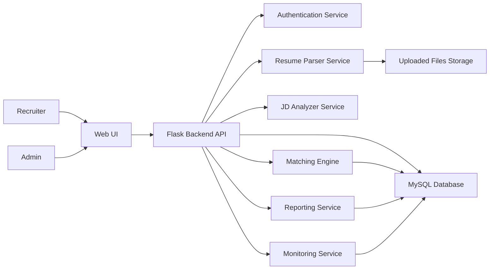

# AI-Based Resume Screening System

## 1. Project Goal

This project is a practical AI + NLP web application that helps recruiters screen resumes against a job profile.

The system has 3 working roles:

- `Admin`: monitors system health, checks logs, and handles issue tickets
- `Recruiter`: creates job profiles, uploads resumes, and views screening results
- `System (AI Engine)`: parses resumes, extracts data, calculates scores, ranks candidates

For a final-year BCA project, the best implementation is:

- `Frontend`: HTML, CSS, JavaScript, Bootstrap, Chart.js
- `Backend`: Python Flask
- `Database`: MySQL
- `AI/NLP`: spaCy, scikit-learn, regex, TF-IDF
- `File Parsing`: `pdfplumber` for PDF, `docx2txt` for DOCX

This keeps the project simple, practical, and fully buildable.

## 2. System Architecture

### 2.1 High-Level Architecture



### 2.2 Layer Explanation

#### Presentation Layer

- Login page
- Recruiter dashboard
- Job profile form
- Resume upload page
- Results and ranking page
- Admin monitoring dashboard

#### Application Layer

- Handles login and role access
- Validates uploaded files
- Calls parser and matching logic
- Stores screening results
- Generates reports
- Tracks logs and issue tickets

#### Data Layer

- MySQL stores users, jobs, resumes, results, reports, logs, and tickets
- Resume files are stored in local folder such as `uploads/resumes/`

## 3. Complete Workflow

### 3.1 Recruiter Workflow

1. Recruiter logs into the system.
2. Recruiter creates a new job profile.
3. Recruiter enters:
   - Job title
   - Job description
   - Required skills
   - Minimum experience
   - Qualification
4. Recruiter uploads one resume or multiple resumes.
5. System validates file type (`PDF`, `DOCX`).
6. System extracts text from each file.
7. AI parser extracts:
   - Candidate name
   - Skills
   - Education
   - Experience
   - Certifications
8. JD analyzer extracts required skills and requirements.
9. Matching engine compares each resume with the job profile.
10. System calculates a final suitability score.
11. If it is a single resume:
   - Show candidate score
   - Show matched skills
   - Show missing skills
   - Show recommendation
12. If it is a bulk upload:
   - Show ranked candidate list
   - Show score and rank
   - Enable filters and sorting
13. Recruiter views dashboard and exports report.

### 3.2 Admin Workflow

1. Admin logs in.
2. Admin checks:
   - Server status
   - Total processed resumes
   - Failed parsing count
   - Open issue tickets
3. Admin opens logs for errors.
4. Admin resolves or updates issue tickets.
5. Admin monitors whether the AI engine is working correctly.

### 3.3 Single Resume Output

- Candidate name
- Overall score
- Skill match percentage
- Experience match
- Qualification match
- Missing skills
- Recommendation:
  - `Strong Match`
  - `Moderate Match`
  - `Weak Match`

### 3.4 Bulk Resume Output

- Candidate name
- Score
- Rank
- Qualification
- Experience
- Filters:
  - Highest score
  - Lowest score
  - Qualification
  - Experience

## 4. Database Schema

The project can be built with 7 practical tables.

### 4.1 `users`

| Field | Type | Description |
|---|---|---|
| id | INT PK AI | User ID |
| name | VARCHAR(100) | Recruiter/Admin name |
| email | VARCHAR(120) UNIQUE | Login email |
| password_hash | VARCHAR(255) | Encrypted password |
| role | ENUM('admin','recruiter') | User role |
| status | ENUM('active','inactive') | Account status |
| created_at | DATETIME | Record creation time |

### 4.2 `job_descriptions`

| Field | Type | Description |
|---|---|---|
| id | INT PK AI | Job ID |
| recruiter_id | INT FK | Created by recruiter |
| title | VARCHAR(150) | Job title |
| description_text | TEXT | Full JD text |
| required_skills | TEXT | Comma-separated skills |
| keywords | TEXT | Important technical keywords |
| min_experience | INT | Minimum years required |
| qualifications | TEXT | Required degree/education |
| created_at | DATETIME | Creation time |

### 4.3 `resumes`

| Field | Type | Description |
|---|---|---|
| id | INT PK AI | Resume ID |
| recruiter_id | INT FK | Uploaded by recruiter |
| candidate_name | VARCHAR(150) | Candidate name |
| email | VARCHAR(120) | Candidate email |
| phone | VARCHAR(20) | Candidate phone |
| skills | TEXT | Extracted skills |
| education | TEXT | Extracted education |
| experience_text | TEXT | Extracted experience details |
| experience_years | DECIMAL(4,1) | Calculated total experience |
| certifications | TEXT | Extracted certifications |
| raw_text | LONGTEXT | Full resume text |
| file_name | VARCHAR(255) | Original file name |
| file_path | VARCHAR(255) | Storage path |
| parse_status | ENUM('pending','success','failed') | Parsing status |
| uploaded_at | DATETIME | Upload time |

### 4.4 `screening_results`

| Field | Type | Description |
|---|---|---|
| id | INT PK AI | Result ID |
| resume_id | INT FK | Resume reference |
| jd_id | INT FK | Job description reference |
| skill_score | DECIMAL(5,2) | Skill score out of 100 |
| experience_score | DECIMAL(5,2) | Experience score out of 100 |
| education_score | DECIMAL(5,2) | Education score out of 100 |
| similarity_score | DECIMAL(5,2) | TF-IDF similarity score |
| suitability_score | DECIMAL(5,2) | Final score |
| ranking | INT | Candidate rank |
| recommendation | VARCHAR(30) | Strong/Moderate/Weak Match |
| created_at | DATETIME | Result creation time |

### 4.5 `reports`

| Field | Type | Description |
|---|---|---|
| id | INT PK AI | Report ID |
| user_id | INT FK | Report generated by |
| jd_id | INT FK | Related job profile |
| type | VARCHAR(50) | Ranking/Skill Gap/Summary |
| date_range | VARCHAR(50) | Report period |
| file_path | VARCHAR(255) | Exported file path |
| created_at | DATETIME | Creation time |

### 4.6 `system_logs`

| Field | Type | Description |
|---|---|---|
| id | INT PK AI | Log ID |
| level | VARCHAR(20) | INFO/WARNING/ERROR |
| module | VARCHAR(100) | Source module |
| message | TEXT | Log message |
| error_trace | TEXT | Stack trace if error occurs |
| created_at | DATETIME | Log time |

### 4.7 `issue_tickets`

| Field | Type | Description |
|---|---|---|
| id | INT PK AI | Ticket ID |
| title | VARCHAR(150) | Issue title |
| description | TEXT | Error details |
| severity | ENUM('low','medium','high') | Ticket priority |
| status | ENUM('open','in_progress','resolved') | Ticket status |
| created_by | INT FK | Creator user |
| assigned_to | INT FK NULL | Assigned admin |
| created_at | DATETIME | Ticket creation time |
| resolved_at | DATETIME NULL | Resolution time |

## 5. Relationships

- One recruiter can create many job descriptions.
- One recruiter can upload many resumes.
- One job description can have many screening results.
- One resume can be screened against many job descriptions.
- One admin can handle many issue tickets.

## 6. API Design

Use REST APIs in Flask.

### 6.1 Authentication APIs

| Method | Endpoint | Purpose |
|---|---|---|
| POST | `/api/auth/login` | User login |
| POST | `/api/auth/logout` | User logout |
| GET | `/api/auth/me` | Get logged-in user profile |

### 6.2 Job Profile APIs

| Method | Endpoint | Purpose |
|---|---|---|
| POST | `/api/jobs` | Create job profile |
| GET | `/api/jobs` | List all job profiles |
| GET | `/api/jobs/<id>` | View single job profile |
| PUT | `/api/jobs/<id>` | Update job profile |
| DELETE | `/api/jobs/<id>` | Delete job profile |

### 6.3 Resume APIs

| Method | Endpoint | Purpose |
|---|---|---|
| POST | `/api/resumes/upload` | Upload single resume |
| POST | `/api/resumes/upload-bulk` | Upload multiple resumes |
| GET | `/api/resumes/<id>` | View parsed resume |

### 6.4 Screening APIs

| Method | Endpoint | Purpose |
|---|---|---|
| POST | `/api/screening/run/<jd_id>` | Run screening for uploaded resumes |
| GET | `/api/screening/results/<jd_id>` | Get ranked results |
| GET | `/api/screening/result/<result_id>` | Get detailed single result |

### 6.5 Report APIs

| Method | Endpoint | Purpose |
|---|---|---|
| GET | `/api/reports/<jd_id>/summary` | Show dashboard summary |
| GET | `/api/reports/export/<jd_id>?format=csv` | Export results |

### 6.6 Admin APIs

| Method | Endpoint | Purpose |
|---|---|---|
| GET | `/api/admin/health` | System health summary |
| GET | `/api/admin/logs` | Fetch logs |
| GET | `/api/admin/tickets` | List tickets |
| POST | `/api/admin/tickets` | Create issue ticket |
| PUT | `/api/admin/tickets/<id>` | Update ticket status |

### 6.7 Example Request

```http
POST /api/jobs
Content-Type: application/json

{
  "title": "Python Developer",
  "description_text": "Looking for Flask, MySQL, REST API developer",
  "required_skills": ["Python", "Flask", "MySQL", "REST API"],
  "keywords": ["backend", "api", "database"],
  "min_experience": 2,
  "qualifications": "BCA/BSc CS/BTech"
}
```

### 6.8 Example Response

```json
{
  "message": "Job profile created successfully",
  "job_id": 12
}
```

## 7. Frontend Pages Design

### 7.1 Login Page

- Email field
- Password field
- Role-based redirect after login

### 7.2 Recruiter Dashboard

- Total jobs created
- Total resumes uploaded
- Candidates screened
- Quick action buttons:
  - Create Job
  - Upload Resume
  - View Results

### 7.3 Create Job Profile Page

- Job title
- Job description
- Required skills
- Keywords
- Minimum experience
- Qualification
- Save button

### 7.4 Upload Resume Page

- Single upload section
- Bulk upload section
- Allowed file formats display
- Upload progress message

### 7.5 Results Page

- Job title at top
- Candidate ranking table
- Filters
- Sort dropdown
- Export button

Suggested columns:

- Candidate name
- Score
- Rank
- Qualification
- Experience
- Recommendation
- View details

### 7.6 Candidate Detail Page

- Parsed resume summary
- Matched skills
- Missing skills
- Score breakdown
- Final recommendation

### 7.7 Reports Page

- Score distribution chart
- Top 5 candidates chart
- Skill gap chart
- Export CSV/PDF

### 7.8 Admin Dashboard

- Server status card
- Error count card
- Failed parsing card
- Open tickets card
- Recent logs table

### 7.9 Ticket Management Page

- Ticket list
- Severity
- Status
- Assign admin
- Resolve button

## 8. Backend Structure

Use a clean Flask structure like this:

```text
project/
├── backend/
│   ├── app.py
│   ├── config.py
│   ├── requirements.txt
│   ├── routes/
│   │   ├── auth_routes.py
│   │   ├── job_routes.py
│   │   ├── resume_routes.py
│   │   ├── screening_routes.py
│   │   ├── report_routes.py
│   │   └── admin_routes.py
│   ├── services/
│   │   ├── auth_service.py
│   │   ├── jd_service.py
│   │   ├── resume_parser.py
│   │   ├── matching_service.py
│   │   ├── report_service.py
│   │   └── monitoring_service.py
│   ├── models/
│   │   ├── user.py
│   │   ├── job_description.py
│   │   ├── resume.py
│   │   ├── screening_result.py
│   │   ├── report.py
│   │   ├── system_log.py
│   │   └── issue_ticket.py
│   ├── utils/
│   │   ├── file_utils.py
│   │   ├── logger.py
│   │   ├── validators.py
│   │   └── text_cleaner.py
│   ├── uploads/
│   │   └── resumes/
│   └── tests/
│       ├── test_auth.py
│       ├── test_parser.py
│       └── test_matching.py
├── frontend/
│   ├── index.html
│   ├── login.html
│   ├── dashboard.html
│   ├── job-form.html
│   ├── upload.html
│   ├── results.html
│   ├── admin.html
│   ├── css/
│   └── js/
└── database/
    └── schema.sql
```

### 8.1 Why This Structure Is Good

- Easy for beginners to understand
- Separates routes, services, models, and utilities
- Makes future features easier to add
- Clean enough for viva or project demonstration

## 9. AI Model Logic

Keep the AI logic simple and explainable.

### 9.1 AI Processing Steps

1. Extract text from resume
2. Clean text
3. Extract important fields
4. Extract requirements from JD
5. Convert resume and JD text into TF-IDF vectors
6. Calculate cosine similarity
7. Calculate skill, education, and experience sub-scores
8. Generate final suitability score

### 9.2 Recommended Scoring Weights

- `Skill Match`: 50%
- `Experience Match`: 20%
- `Education Match`: 15%
- `Text Similarity`: 15%

### 9.3 Final Score Formula

```python
final_score = (
    skill_score * 0.50 +
    experience_score * 0.20 +
    education_score * 0.15 +
    similarity_score * 0.15
)
```

### 9.4 Recommendation Logic

- `>= 80`: Strong Match
- `>= 60 and < 80`: Moderate Match
- `< 60`: Weak Match

### 9.5 Bias Reduction Rule

Do not use these attributes in scoring:

- Gender
- Age
- Photo
- Marital status
- Religion
- Full address

If such words appear in a resume, ignore them before similarity calculation.

## 10. Resume Parsing Logic

### 10.1 Parsing Flow

1. Check file extension.
2. Extract raw text.
3. Clean extra spaces and special characters.
4. Use spaCy and regex to detect important entities.
5. Match extracted words with a predefined skill dictionary.
6. Detect degree keywords for education.
7. Estimate total experience using regex patterns.
8. Store parsed values in database.

### 10.2 Practical Skill Extraction

Maintain a Python list such as:

```python
SKILL_DB = [
    "python", "java", "flask", "django", "mysql", "sql",
    "html", "css", "javascript", "react", "git", "rest api"
]
```

Then search these skills in cleaned resume text.

### 10.3 Simple Parsing Snippet

```python
import re

def extract_skills(text, skill_db):
    text_lower = text.lower()
    found = []
    for skill in skill_db:
        if skill.lower() in text_lower:
            found.append(skill)
    return sorted(set(found))

def extract_experience_years(text):
    matches = re.findall(r'(\d+)\+?\s+years?', text.lower())
    if not matches:
        return 0
    return max(int(value) for value in matches)
```

## 11. Matching Algorithm

### 11.1 Skill Match Score

```python
def calculate_skill_score(required_skills, candidate_skills):
    required = set([s.lower() for s in required_skills])
    candidate = set([s.lower() for s in candidate_skills])
    if not required:
        return 0
    matched = required.intersection(candidate)
    return (len(matched) / len(required)) * 100
```

### 11.2 Experience Match Score

```python
def calculate_experience_score(candidate_exp, required_exp):
    if required_exp <= 0:
        return 100
    if candidate_exp >= required_exp:
        return 100
    return (candidate_exp / required_exp) * 100
```

### 11.3 Education Match Score

Simple rule:

- If required degree appears in extracted education text, give `100`
- If related degree appears, give `70`
- Otherwise give `30`

Example:

- Required: `BCA/BTech`
- Candidate education: `BSc Computer Science`
- Score: `70`

### 11.4 Text Similarity Score

Use `TfidfVectorizer` and `cosine_similarity`.

```python
from sklearn.feature_extraction.text import TfidfVectorizer
from sklearn.metrics.pairwise import cosine_similarity

def get_similarity_score(job_text, resume_text):
    vectorizer = TfidfVectorizer(stop_words='english')
    tfidf = vectorizer.fit_transform([job_text, resume_text])
    score = cosine_similarity(tfidf[0:1], tfidf[1:2])[0][0]
    return round(score * 100, 2)
```

### 11.5 Ranking Logic

1. Sort by `suitability_score` descending
2. If tie, sort by `skill_score` descending
3. If still tie, sort by `experience_years` descending

## 12. Filtering Logic

The results page should support simple filters.

### 12.1 Required Filters

- Highest score
- Lowest score
- Qualification
- Experience

### 12.2 Practical Query Logic

```python
SELECT candidate_name, suitability_score, ranking, education, experience_years
FROM screening_results sr
JOIN resumes r ON sr.resume_id = r.id
WHERE sr.jd_id = 10
  AND r.experience_years >= 2
  AND r.education LIKE '%BCA%'
ORDER BY sr.suitability_score DESC;
```

### 12.3 UI Filter Inputs

- Sort dropdown:
  - Highest score
  - Lowest score
- Qualification dropdown
- Minimum experience input

## 13. Admin Monitoring System

Admin does not screen resumes directly. Admin only monitors.

### 13.1 What Admin Should See

- Total users
- Active recruiters
- Jobs created today
- Resumes processed today
- Failed parsing count
- Open issue tickets
- Latest 20 error logs

### 13.2 Health Check Logic

Create a simple API:

- `/api/admin/health`

It returns:

- Database status
- Upload folder status
- Parser status
- Total errors today

Example response:

```json
{
  "database": "connected",
  "upload_folder": "available",
  "parser": "running",
  "errors_today": 3
}
```

### 13.3 Ticket Creation Rules

Create a ticket when:

- Resume parsing fails repeatedly
- Database insert fails
- File format is corrupt
- Report export fails

## 14. Security Implementation

### 14.1 Authentication Security

- Store passwords using `generate_password_hash()`
- Verify passwords using `check_password_hash()`
- Restrict pages using session-based login
- Allow access based on role:
  - Recruiter can manage jobs, resumes, and results
  - Admin can only monitor logs, health, and tickets

### 14.2 File Upload Security

- Allow only `PDF` and `DOCX`
- Limit file size
- Rename uploaded files with timestamp or UUID
- Store files outside public static folder if possible

### 14.3 Database Security

- Use parameterized queries or ORM
- Never build SQL using raw user input
- Validate all filter and form values

### 14.4 Data Privacy Rules

- Resume files should be accessible only after login
- Sensitive data should not be shown on public URLs
- Ignore bias-related personal information during scoring

## 15. Error Handling System

### 15.1 Common Errors

- Invalid login
- Unsupported file type
- Empty JD
- Resume text extraction failed
- Database connection error
- Duplicate upload

### 15.2 Error Handling Strategy

- Validate input on frontend
- Validate again on backend
- Return standard JSON error messages
- Store errors in `system_logs`
- Create ticket for critical failures

### 15.3 Standard Error Response

```json
{
  "success": false,
  "message": "Unsupported file type. Please upload PDF or DOCX."
}
```

### 15.4 Flask Error Example

```python
from flask import jsonify

@app.errorhandler(500)
def internal_error(error):
    return jsonify({
        "success": False,
        "message": "Internal server error"
    }), 500
```

## 16. Deployment Plan

### 16.1 Local Deployment

1. Install Python 3.x
2. Create virtual environment
3. Install packages from `requirements.txt`
4. Create MySQL database
5. Import `database/schema.sql`
6. Configure `.env`
7. Start Flask server
8. Open frontend in browser

### 16.2 Example Commands

```bash
python -m venv venv
venv\Scripts\activate
pip install -r requirements.txt
flask run
```

### 16.3 Cloud Deployment

You can deploy later on:

- AWS
- Azure
- GCP
- Render
- Railway

For a BCA project demo, local deployment is enough and safer.

## 17. Tech Stack Justification

### 17.1 Why Flask

- Lightweight
- Easy to learn
- Faster to build than Django for this project
- Good for REST APIs and modular services

### 17.2 Why MySQL

- Structured relational data fits this project
- Easy integration with Flask
- Easy to explain in viva

### 17.3 Why spaCy + TF-IDF

- Enough for basic NLP
- Fast and practical
- Does not require heavy GPU training
- Easy to demonstrate AI logic

### 17.4 Why HTML/CSS/JS + Bootstrap

- Simple UI building
- Beginner-friendly
- Faster than setting up a large frontend framework

### 17.5 Why Chart.js

- Good for dashboard charts
- Easy to integrate
- Lightweight

## 18. Recommended Implementation Plan

Build the project in this order:

1. Create MySQL database and tables
2. Build login and role system
3. Build job profile form
4. Build resume upload and file storage
5. Build parsing logic
6. Build matching and ranking logic
7. Build result page with filters
8. Build report export
9. Build admin dashboard and ticket system
10. Test end-to-end flow

## 19. Final Practical Summary

This system works like a real screening pipeline:

- Recruiter creates a job profile
- Recruiter uploads resumes
- System extracts resume data using NLP
- System compares each resume with job requirements
- System generates a score
- For single upload, it shows direct analysis
- For bulk upload, it shows ranked candidate list with filters
- Admin monitors errors, logs, and issue tickets

For a BCA project, this is the best balance of:

- AI-based functionality
- Practical implementation
- Clear architecture
- Easy explanation in viva
- Beginner-friendly coding structure

If you want, this blueprint can be directly converted into:

- database SQL
- Flask backend code
- HTML frontend pages
- project report chapters
